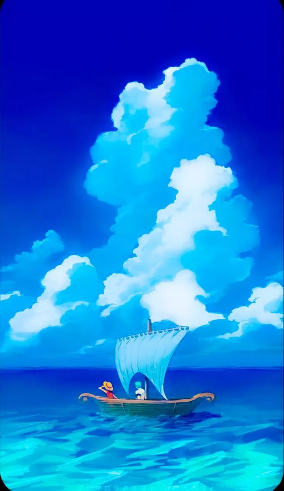

That image is an excellent base for a Hyprland rice — it already has a very cohesive visual language:

* cold ocean blues
* ink-black/navy shadows
* bright cyan highlights
* desaturated whites
* high motion + contrast
* “samurai watercolor manga” energy

For transparent terminals and overlays, the key is:

* **low saturation backgrounds**
* **high-contrast foregrounds**
* **carefully restrained accent usage**
* avoiding overly bright blues as base backgrounds

# Recommended Theme Direction

## Overall Style

**“Inkwave Samurai”**

A cold Japanese watercolor + cyber-minimal aesthetic:

* dark navy surfaces
* washed ice-blue highlights
* sharp cyan accents
* soft parchment whites
* slightly muted UI to preserve readability

This works especially well for:

* transparent Kitty/WezTerm
* Neovim transparency
* Hyprland blur
* wlogout/waybar/mako
* Firefox sidebery themes
* GTK dark themes

---

# Core Palette (Chosen for You)

## Base Colors

| Role             | Color        | Hex       |
| ---------------- | ------------ | --------- |
| Background       | Deep Ink     | `#0B1220` |
| Secondary BG     | Storm Navy   | `#111827` |
| Surface          | Washed Slate | `#1B263B` |
| Floating Surface | Blue Black   | `#162033` |

## Foreground

| Role           | Color       | Hex       |
| -------------- | ----------- | --------- |
| Primary Text   | Frost White | `#E6EEF7` |
| Secondary Text | Mist Blue   | `#B6C2D9` |
| Muted Text     | Fog Grey    | `#7E8AA3` |

## Accents

| Role           | Color       | Hex       |
| -------------- | ----------- | --------- |
| Primary Accent | Water Cyan  | `#42C6FF` |
| Bright Accent  | Splash Blue | `#7BE0FF` |
| Deep Accent    | Katana Blue | `#2563EB` |
| Selection      | Ice Glow    | `#8EDFFF` |

## Semantic

| Role    | Color       | Hex       |
| ------- | ----------- | --------- |
| Success | Seafoam     | `#6EE7B7` |
| Warning | Sand Gold   | `#E6C07B` |
| Error   | Crimson Ink | `#F87171` |

---

# Transparency Recommendations

## Terminal

Use:

* background opacity: `0.72–0.82`
* blur enabled
* slight shadow

Avoid full transparency or the wallpaper becomes visually noisy behind code.

Recommended:

```conf
background_opacity 0.78
```

---

# Best Existing Theme Ecosystem Matches

## Neovim

### BEST FIT: `kanagawa.nvim`

This is almost perfect stylistically.

Why:

* Japanese aesthetic
* muted blues
* excellent transparency support
* beautiful with transparent terminals

Use:

```lua
require('kanagawa').setup({
    transparent = true,
    theme = "wave",
})
```

Minor overrides:

```lua
colors = {
    palette = {
        sumiInk0 = "#0B1220",
        crystalBlue = "#42C6FF",
    }
}
```

---

## GTK Theme

### BEST FIT: `Colloid`

Use:

* dark variant
* blue accent

Reason:

* modern libadwaita compatibility
* excellent blur/transparency pairing
* clean enough not to fight wallpaper

Alternative:

* `Tokyonight GTK`
* `Graphite GTK`

But Colloid Blue Dark fits best.

---

## Firefox / Mozilla

### BEST FIT:

#### `Firefox Color` custom palette

OR

#### `Cascade` + custom colors

Use:

* dark navy toolbar
* cyan active tabs
* muted inactive tabs

Recommended:

```css
Toolbar: #0B1220
Tab Active: #162033
Accent: #42C6FF
Text: #E6EEF7
```

---

# Waybar Theme Direction

Use:

* glassmorphism
* 8–12px radius
* translucent navy
* cyan hover states

Example:

```css
background: rgba(11,18,32,0.72);
border: 1px solid rgba(66,198,255,0.18);
color: #E6EEF7;
```

Workspace active:

```css
background: #42C6FF;
color: #0B1220;
```

---

# Mako / Notifications

This palette will look fantastic:

```ini
background-color=#111827DD
text-color=#E6EEF7
border-color=#42C6FF
progress-color=over #2563EB
border-radius=12
```

---

# Hyprland Blur

Ideal settings:

```conf
decoration {
    rounding = 12

    blur {
        enabled = true
        size = 8
        passes = 3
        noise = 0.02
    }

    shadow {
        enabled = true
        range = 18
        render_power = 3
        color = rgba(00000088)
    }
}
```

---

# Cursor Theme

Perfect fits:

* Bibata Ice
* Nordzy Cyan
* Catppuccin Mocha Blue

---

# Icon Theme

Best match:

* Tela Circle Blue
* Papirus Dark
* Colloid Icons

---

# Fonts

This wallpaper wants:

* clean modern mono
* slightly artistic UI font

## Terminal / Editor

* JetBrains Mono
* Berkeley Mono
* Iosevka Aile

## UI

* Inter
* IBM Plex Sans
* SF Pro Display

---

# Overall Aesthetic Reference

Your final rice would sit stylistically between:

* Kanagawa
* Tokyo Night Storm
* Nord
* Ghost of Tsushima UI
* modern anime splash-art minimalism

Less neon cyberpunk.
More “cold ink and water.”

This is the right move because your wallpaper already contains intense motion; the UI should be restrained and atmospheric.

<!-- ========================================================================================================================================================================================================================= -->

# follow up on second image for monitor

For a vertical secondary monitor, you want wallpapers that:

* keep a strong silhouette in the center third
* have negative space for widgets/Discord/browser sidebars
* avoid visual clutter behind transparent apps
* preserve your blue-black watercolor aesthetic

You already nailed the “main cinematic wallpaper” vibe with the water-slash Musashi image. For the vertical monitor, I’d lean more atmospheric and contemplative rather than another high-action piece.

These are the strongest fits I found:

# Best Match (Vertical Monitor)

## Blue Solitary Musashi

This one is almost perfect for a portrait display:

* vertical composition
* deep cobalt atmosphere
* huge negative space
* painterly motion
* fits your cyan/navy palette exactly

Source collections: ([Wallpapers.com][1])

This would look incredible with:

* transparent terminal on lower half
* Waybar floating top-left
* cava/audio visualizer lower-right

---

# Best Atmospheric Companion

## Purple-Night Musashi

More subdued and introspective:

* foggy violet sky
* silhouette-heavy
* minimal foreground clutter
* excellent for readability

This shifts your rice slightly toward:

* Tokyo Night
* Kanagawa Dragon
* late-night rainy cyber-feudal vibe

You could even rotate between this and the blue main wallpaper.

---

# Best Mobile/Portrait Art Style

## Cyan Kimono Watercolor

This is probably the closest stylistic match to your existing wallpaper.

Why it works:

* same watercolor texture
* cyan fabric tones
* sparse composition
* soft whites preserve readability

This one would pair beautifully with:

* blur-heavy Hyprland
* semi-transparent Firefox
* rounded GTK widgets

---

# Best Monochrome Secondary Display

## Stormcloud Musashi

For a darker side monitor:

Excellent if:

* your primary monitor is colorful
* secondary monitor hosts terminals/logs
* you want less eye fatigue

This lets your accent colors carry the personality instead of the wallpaper.

---

# Best Minimalist Vertical Option

## Prayer Pose Musashi

Very clean for portrait mode:

This is ideal if you:

* keep lots of windows on secondary
* use Yazi/Neovim/TMUX there
* want fewer distractions

---

# My Actual Recommendation

## Primary (main ultrawide/landscape)

Use your current water-slash wallpaper.

## Secondary vertical monitor

Use either:

1. the blue solitary Musashi wallpaper
2. the cyan watercolor kimono wallpaper

Those two preserve:

* the same emotional tone
* same blue/cyan temperature
* same brushwork aesthetic
* same “wandering swordsman” energy

without becoming visually repetitive.

---

# Theme Adjustment for Dual-Wallpaper Setup

If you use the blue/purple vertical wallpapers, slightly tweak your accents:

## Updated Accent Set

| Role             | Hex       |
| ---------------- | --------- |
| Primary Accent   | `#58D6FF` |
| Soft Accent      | `#7AA2F7` |
| Secondary Accent | `#A78BFA` |
| Hover            | `#89DDFF` |

This lets:

* cyan pull from water
* indigo pull from sky
* violet pull from nighttime pieces

Very Kanagawa/Tokyo-Night hybrid.

---

# Perfect Theme Stack For This Rice

If I were building this exact setup:

| Component     | Theme                  |
| ------------- | ---------------------- |
| GTK           | Colloid Blue Dark      |
| Qt            | Kvantum Kanagawa       |
| Neovim        | Kanagawa Wave          |
| Terminal      | Kitty + transparency   |
| Firefox       | Cascade + custom cyan  |
| Icons         | Tela Circle Blue       |
| Cursor        | Bibata Ice             |
| Notifications | Mako glassmorphism     |
| Launcher      | Walker or Rofi-wayland |
| Lockscreen    | Hyprlock blur          |

---

# One More Suggestion

You should strongly consider:

* subtle animated wallpaper
* slow water particle effect
* snowfall/rain shader

with `mpvpaper` or `swww` transitions.

Because Vagabond’s watercolor art style responds extremely well to:

* gentle movement
* blur
* transparency
* layered depth

Especially on OLED/high-refresh displays.

Useful wallpaper sources I found while searching:

* Wallpapers.com Vagabond collection ([Wallpapers.com][1])
* AlphaCoders Vagabond gallery ([Alpha Coders][2])
* 4KWallpapers Vagabond section ([4kwallpapers.com][3])

[1]: https://wallpapers.com/vagabond-manga?utm_source=chatgpt.com "[100+] Vagabond Manga Wallpapers | Wallpapers.com"
[2]: https://alphacoders.com/vagabond-%28manga%29-wallpapers?utm_source=chatgpt.com "Vagabond (Manga) Wallpapers and Backgrounds: Free HD Download [40+]"
[3]: https://4kwallpapers.com/vagabond?utm_source=chatgpt.com "Vagabond 4K Wallpapers"


# follow up with vertical image of one piece ocean


Yes — this changes the theme in a really good way.

Your setup now has a much stronger identity:

* **Primary monitor:** dark ink + violent water motion (Vagabond)
* **Secondary vertical:** dreamlike open ocean + bright cyan sky (One Piece)

That combination creates a really compelling balance:

* intensity + calm
* grounded + expansive
* dark foreground + luminous ambient light

The biggest shift is:

> your overall palette should become more *luminous and airy*, while still preserving the deep navy base.

The original palette I gave leaned very “ink samurai.”
Now you want:

* brighter cyan highlights
* cleaner whites
* deeper ultramarine
* softer dark surfaces

Less:

* slate gray
* muted nord

More:

* glowing ocean-at-noon

---

# Updated Theme Palette

## Core Backgrounds

| Role             | Hex       | Notes                     |
| ---------------- | --------- | ------------------------- |
| Main Background  | `#09111F` | deep ocean navy           |
| Secondary BG     | `#0F172A` | cleaner blue-black        |
| Surface          | `#16243A` | softened for transparency |
| Floating Surface | `#1B3152` | subtle ocean blue         |

---

# Foregrounds

| Role           | Hex       |
| -------------- | --------- |
| Primary Text   | `#F2FAFF` |
| Secondary Text | `#C7DCEF` |
| Muted Text     | `#89A3BA` |

This is important:

* your text should now feel *crisp like sunlight*
* not muted parchment like before

---

# New Accent System

## Primary Accent

### Ocean Cyan

```txt
#4FD8FF
```

This becomes:

* active workspace
* links
* selection
* cursor accents
* notification borders

---

## Secondary Accent

### Sky Blue

```txt
#7CB7FF
```

Use for:

* hover states
* inactive highlights
* secondary borders

---

## Deep Accent

### Ultramarine

```txt
#244BFF
```

Inspired directly by the sky in your One Piece wallpaper.

Perfect for:

* gradients
* lockscreen
* focused windows

---

## Glow Accent

### Tropical Ice

```txt
#A8F0FF
```

Reserved for:

* active terminal cursor
* active tab underline
* audio visualizer
* subtle neon touches

---

# What This Does Aesthetically

Your rice now shifts from:

## “wandering ronin”

to:

## “oceanic dreamscape anime workstation”

Still mature.
Still dark.
But now much more vibrant and ethereal.

---

# Theme Ecosystem Changes

## Neovim

### BEST FIT NOW:

## Tokyo Night Storm

instead of Kanagawa.

Why:

* richer blues
* brighter cyans
* better contrast against transparent terminals
* matches One Piece sky tones better

Recommended overrides:

```lua
colors = {
    bg = "#09111F",
    bg_dark = "#0F172A",
    cyan = "#4FD8FF",
    blue = "#7CB7FF",
}
```

---

# Terminal Transparency

You can now go slightly MORE transparent because the vertical wallpaper has huge clean areas.

Recommended:

```conf
background_opacity 0.72
```

The bright sky will create gorgeous ambient lighting behind terminals.

---

# Hyprland Borders

This setup wants:

## gradients

Focused:

```txt
#4FD8FF -> #244BFF
```

Inactive:

```txt
#1B3152
```

---

# Waybar Styling

Now you should lean:

* floating
* luminous
* softer edges
* slightly glassier

Example:

```css
background: rgba(9,17,31,0.58);
border: 1px solid rgba(79,216,255,0.22);
```

The old heavier dark style would now feel too oppressive.

---

# GTK Theme Recommendation Changes

## BEST FIT NOW:

### Catppuccin Macchiato Blue

OR

### Colloid Nord Dark Blue

You now want:

* slightly brighter surfaces
* less charcoal
* more soft-blue layering

---

# Firefox Theme Direction

Your browser should now look like:

* ocean horizon
* bright tabs floating over dark water

Recommended:

```css
Toolbar: #09111F
Active Tab: #16243A
Accent: #4FD8FF
Hover: #7CB7FF
```

---

# Bonus Suggestion (Strongly Recommended)

This dual-monitor combo is PERFECT for:

## pywal / matugen

Because:

* one wallpaper is dark
* one wallpaper is bright
* both share the same cyan-blue identity

You could:

* dynamically derive colors
* then slightly override saturation manually

This would make:

* Discord
* GTK
* terminals
* btop
* notifications
  all harmonize automatically.

And honestly:
this is one of the better foundations for a truly cohesive anime-inspired Linux rice I've seen.

